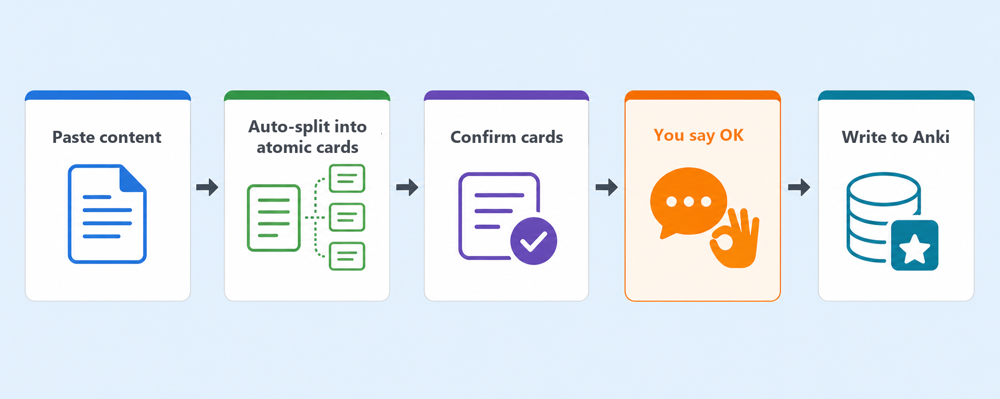

# anki-tutor

[English](README.md) | [Chinese](README.zh-CN.md)

Turn any content into high-quality Anki flashcards — and coach your learning plan along the way, tuning it into the "forgetting curve" that fits you best.

For exam crammers, med students, language learners, programmers… anyone who uses Anki but is tired of typing cards by hand or digging through scheduling parameters.

## Why you'll like it

- **Cards from plain words.** Paste text, code, or formulas — or drop in a screenshot — and it splits everything into atomic flashcards. One nod from you and they're in Anki. No more hand-typing cards one by one.
- **Preview first, write later.** Every batch arrives as a preview table you check card by card; duplicates are flagged before anything is written; splitting follows Wozniak's rules — the SuperMemo founder's gold standard for card crafting. Not one card enters your deck without your nod.
- **It keeps an eye on how you're doing.** Every diagnosis ends with an auto-generated HTML dashboard you can open right in your browser.
- **FSRS without the fiddling — just talk about your goal.** Say "100 days until my exam" and it sets up a sprint recipe and back-computes how many new cards per day. It remembers your deadline, so it won't talk you out of your deliberate cramming in favor of "long-term optimal".
- **Works out of the box, on any agent.** Runs on Claude Code, ZCode, or anything that speaks the SKILL.md convention. Diagnostics are strictly read-only; every write needs your confirmation — your deck, your call.

## What it looks like

Open your agent and just talk to it — all three intents are recognized:

```
"Turn this photosynthesis passage into anki cards"   # card making
"I keep forgetting things lately, look into it"      # diagnosis
"100 days until my exam, plan my review rhythm"      # configuration
```

The full card-making flow — the core experience is that **you can always hit the brakes**:



It previews the split as a table, and only writes after your nod:

```
## Card preview (3 cards)

Target deck: Biology::Photosynthesis
Note types: mixed

| # | Type | Front | Back | Tags | Why this card |
|---|------|-------|------|------|---------------|
| 1 | Basic | What are the reactants of photosynthesis? | CO₂ and H₂O | reactant | Explicit Q-A pair in the source |
| 2 | Cloze | Photosynthesis converts light energy into {{c1::chemical energy}}, stored in {{c2::glucose}} | — | product | Key-term cloze; one passage, two cards |
| 3 | Basic (rev) | What role does CO₂ play in photosynthesis? | Reactant (carbon source) | reactant | Reverse test to break direction dependence |

Reply `OK` to write; or say `#2 switch to Basic`, `delete #1`, `too fragmented, merge into 2`.
Duplicate matches are flagged ⚠ with a side-by-side comparison — skip / update / create anyway is your call.

⏸ Nothing is written to Anki until you confirm.
```

After writing you get a report: `✓ N added → deck name`, `✗ M failed (reasons)`, `⏭ K skipped (duplicates / your call)`.

## Platform compatibility

The skill is driven by a single `SKILL.md`; helper scripts and the optional Anki add-on source ship with the repo, so it isn't tied to any specific agent. Verified on **Claude Code** and **ZCode**; any agent that understands the SKILL.md convention should work.

## Requirements

Scripts and add-on sources are all bundled — you only need the runtime:

| Component | Required | What it does | If missing |
|---|---|---|---|
| Anki desktop | Yes (running) | Cards are written through it | Won't work |
| AnkiConnect add-on | Yes | Install inside Anki; provides the local read/write API (default `localhost:8765`) | Won't work |
| fsrs_bridge add-on | Optional | Fully automatic FSRS optimization | The agent auto-installs it when missing (restart Anki to take effect); only manual install if that fails — see `plugin/fsrs_bridge/README.md`. Without it, FSRS optimization degrades to manual GUI guidance |
| Python 3.7+ | Optional (recommended) | Read-only operations (dedup checks, diagnostics collection) run faster and safer via the bundled script | Automatically degrades to the curl flow — no features lost |

## Install

Pick **one** of the three ways below — you don't need all of them:

### Option 1: One sentence inside your agent (easiest)

In any agent that supports skills and terminal access — Claude Code, Codex, ZCode, DeepSeek, etc. — just say in the chat:

```
Install this skill for me: https://github.com/Simoniscoming/anki-tutor
```

The agent installs it into the right directory; start a **new session** and it takes effect.

### Option 2: One command in the terminal (requires Node.js)

Open a terminal (PowerShell or bash) and run:

```bash
npx skills add Simoniscoming/anki-tutor
```

> Uses [skills.sh](https://skills.sh), the community-standard tool — supported by virtually every SKILL.md-compatible agent; it installs into the right directory automatically. Add `-g` for a global install.

### Option 3: Git clone (fully manual, no Node/npx needed)

Clone the repo into your agent's skills directory and **keep the folder named `anki-tutor`** (same as the skill name, avoids confusion):

#### Claude Code

```bash
# Project-level (current project only)
git clone https://github.com/Simoniscoming/anki-tutor.git .claude/skills/anki-tutor

# Global (all projects)
git clone https://github.com/Simoniscoming/anki-tutor.git ~/.claude/skills/anki-tutor
```

#### ZCode

```bash
# User-level (all projects)
git clone https://github.com/Simoniscoming/anki-tutor.git ~/.agents/skills/anki-tutor

# Project-level (current project only)
git clone https://github.com/Simoniscoming/anki-tutor.git .agents/skills/anki-tutor
```

> On Windows, `~` is `C:\Users\<your username>`.
> A project-level skill overrides a same-named user-level one — handy for a "stable user-level + experimental project-level" setup.

#### Other SKILL.md-compatible agents

Drop it into your agent's skills directory (check its docs for the exact path).

## Update

Skills are static files on disk — agents don't auto-update them:

```bash
git -C <skill install path> pull
```

(For npx installs: re-run `npx skills add Simoniscoming/anki-tutor`, or git pull inside the install directory.)
Changes take effect from the **next** session.

## License

MIT — see [LICENSE](./LICENSE). Free to use, modify, and distribute (including commercially), as long as the copyright notice is retained.
