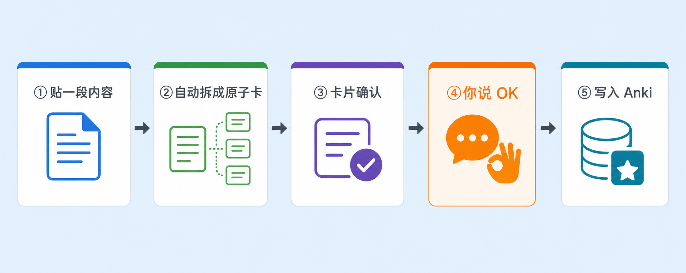

# anki-tutor

[English](README.md) | [中文](README.zh-CN.md)

把内容变成高质量 Anki 闪卡，还能参与诊断你的学习计划，从而优化成最适合你的"遗忘曲线"。

考研党、医学生、语言学习者、程序员……只要你在用 Anki，又嫌逐张手敲制卡慢、复习参数懒得啃，它都接得住。

> 一个 AI agent **Skill**——装进 Claude Code / ZCode 即可使用。

## ✨ 为什么用它

- **说句话就成卡。** 贴一段文本、代码、公式，甚至甩张截图，自动拆成一张张原子闪卡，你点头就写进 Anki——从此告别逐张手敲。
- **先过目，再入库。** 每一批卡先出预览表让你逐张过目，写入前自动查重防重复，拆卡遵循 SuperMemo 创始人的 Wozniak 法则——你没点头，一张卡也进不了库。
- **它还盯着你学得怎么样。** 诊断完自动出 HTML 看板，浏览器打开就能看。
- **FSRS 不用自己调，聊目标就行。** 你说"考研还剩 100 天"，它配好速通配方、反推每天该加多少新卡；还记着你的截止日期，不会把你刻意的"速通"劝退成"长期最优"。
- **开箱即用，不挑平台。** Claude Code / ZCode / 任何认 SKILL.md 的 agent 都能跑；诊断全程只读，任何写入都要你确认——你的库，你做主。

## 🚀 安装

三种方式**任选其一**即可，不需要都做：

### 方式一：在你的 agent 里一句话安装（最简单）

Claude Code、Codex、ZCode、DeepSeek 等任意支持 Skill 和终端的 agent 工具，对话框里直接说：

```
帮我安装这个 skill：https://github.com/Simoniscoming/anki-tutor
```

agent 会自动把它装到正确的目录，**开个新会话**即生效。

### 方式二：在终端里执行一条命令（需要 Node.js）

打开终端（PowerShell / bash 均可），执行：

```bash
npx skills add Simoniscoming/anki-tutor
```

> 用的社区通用工具 [skills.sh](https://skills.sh)，认 SKILL.md 规范的 agent 基本都支持，会自动装到对应目录；加 `-g` 装到全局。

### 方式三：Git 克隆安装（纯手动，不依赖 Node 和 npx）

把仓库 clone 到你 agent 约定的 skills 目录，**目录名保持 `anki-tutor`**（与 skill 名一致，避免混乱）：

#### Claude Code

```bash
# 项目级（仅当前项目可用）
git clone https://github.com/Simoniscoming/anki-tutor.git .claude/skills/anki-tutor

# 全局（所有项目可用）
git clone https://github.com/Simoniscoming/anki-tutor.git ~/.claude/skills/anki-tutor
```

#### ZCode

```bash
# 用户级（所有项目可用）
git clone https://github.com/Simoniscoming/anki-tutor.git ~/.agents/skills/anki-tutor

# 项目级（仅当前项目可用）
git clone https://github.com/Simoniscoming/anki-tutor.git .agents/skills/anki-tutor
```

> Windows 上 `~` 即 `C:\Users\<你的用户名>`。
> 同名 Skill 下，项目级会覆盖用户级。可据此做"用户级稳定版 + 项目级实验版"双轨。

#### 其它兼容 SKILL.md 的 agent

放进你 agent 约定的 skills 目录即可（具体路径查你 agent 的文档）。

## 🎬 用起来什么样

打开你的 agent，像平时聊天一样说，三种意图它都认：

```
"把这段光合作用做成 anki 卡"        # 制卡
"我最近老忘，帮我看看怎么回事"      # 诊断
"考研还剩 100 天，帮我定复习节奏"   # 配置
```

制卡的完整流程，核心体验是**你永远踩得住刹车**：



拆完先出预览表，你点头才写入：

```
## 制卡预览（共 3 张）

目标牌组：Biology::Photosynthesis
笔记类型：混合

| # | 类型 | Front | Back | Tags | 拆卡理由 |
|---|------|-------|------|------|---------|
| 1 | Basic | 光合作用的反应物是什么？ | CO₂ 和 H₂O | reactant | 原文有明确 Q-A 对 |
| 2 | Cloze | 光合作用把光能转化为{{c1::化学能}}，储存在{{c2::葡萄糖}}中 | — | product | 关键术语填空，一段生 2 张 |
| 3 | Basic (rev) | CO₂ 在光合作用中的角色是？ | 反应物（碳源） | reactant | 反向测，打破方向依赖 |

回复 `OK` 就写入；也可以说 `#2 换成 Basic`、`删 #1`、`太碎了，合并成 2 张`。
查重命中相似卡时，表里会标 ⚠ 并展开对比，跳过/更新/仍新建由你决定。

⏸ 在你确认前，它不会写入 Anki。
```

写入后你会收到报告：`✓ 成功 N 张 → 牌组名`、`✗ 失败 M 张（原因）`、`⏭ 跳过 K 张（重复 / 你要求的）`。

## 🧩 平台兼容

本 Skill 以一份 `SKILL.md` 为入口，配套的辅助脚本和可选 Anki 插件源码都随仓库自带，不绑定特定 agent。已在 **Claude Code**、**ZCode** 上验证，其它认 SKILL.md 规范的 agent 理论上通用。

## ⚙️ 依赖

脚本和插件源码都是仓库自带的，你只需准备运行环境：

| 组件 | 必需性 | 作用 | 缺了会怎样 |
|---|---|---|---|
| Anki 桌面端 | 必需（运行中） | 写库得靠它 | 用不了 |
| AnkiConnect 插件 | 必需 | 在 Anki 里安装，提供本地读写接口（默认 `localhost:8765`） | 用不了 |
| fsrs_bridge 插件 | 可选 | FSRS 全自动优化 | agent 检测到没装会自动帮你装（重启 Anki 生效）；失败才需手动，见 `plugin/fsrs_bridge/README.md`。不装则降级为 GUI 手动指引 |
| Python 3.7+ | 可选（推荐） | 查重、诊断采集等只读操作走自带脚本，更快更稳 | 自动降级为 curl 流程，功能不缺 |

## 🔄 更新

Skill 是磁盘上的静态文件，agent 不会自动更新：

```bash
git -C <Skill 安装路径> pull
```

（npx 安装的：重跑一次 `npx skills add Simoniscoming/anki-tutor`，或对安装目录 git pull。）
改动在**下次**会话生效。

## ⚖️ License

MIT — 见 [LICENSE](./LICENSE)。可自由使用、修改、分发（含商用），保留版权声明即可。
